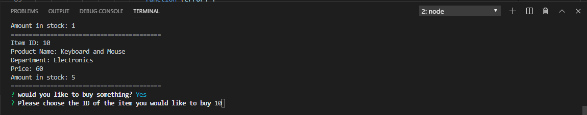

# baliabba
A CLI storefront that functions like Amazon or Alibaba
By [Dan Smith](https://kentarosmith.github.io/)


This CLI app simulates a storefront from the customer's perspective. It lets the customer view the store's inventory, then choose what item they want to buy and how many they would like.

### Node Packages Used:

* [dotenv](https://www.npmjs.com/package/dotenv)
* [inquirer](https://www.npmjs.com/package/inquirer)
* [mysql](https://www.npmjs.com/package/mysql)

## How it works:

### Setup:
1. Make sure you have [Node](https://nodejs.org/en/) and [GitBash](https://gitforwindows.org/) installed.
2. Clone this repository
3. Install the Node Packages 
   3. Use the command 'npm install' in bash to ensure that the app has everything it needs to work

   ### Product Demo:
### Following the prompts:
#### Initial Load
>Confirm yes or no
- Upon loading the app using ```node customer.js``` the app will prompt you to confirm whether or not you'd like to buy something. Select ```y``` or hit enter to proceed.

>Enter Item ID
- Enter in the ID of the item you would like to purchase

>quantity
- Next choose the amount of items you would like to purchase! The app will tell you that you cannot if you exceed the amount available.

>checkout
- Lastly, confirm your order and watch it give you your new total!


